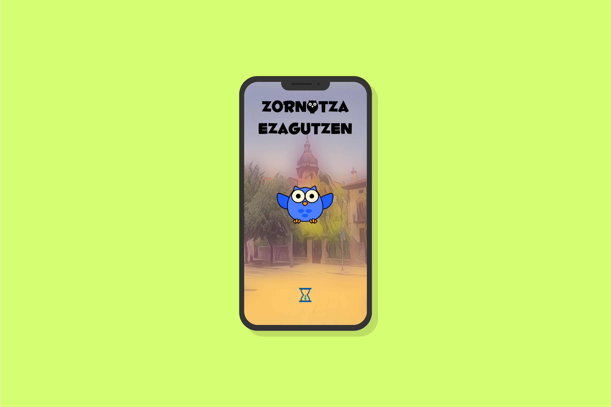
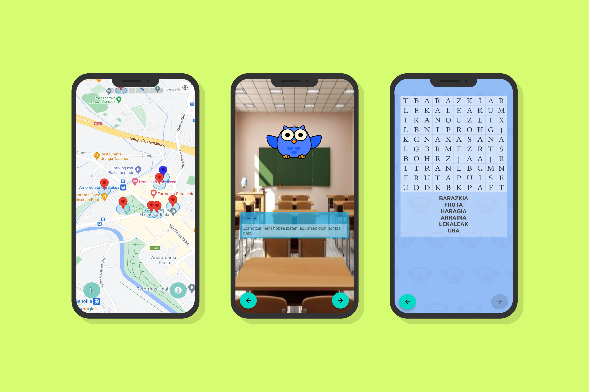

# Zornotza Ezagutzen 

## Deskribapena 📝 
Zornotza Ezagutzen Android-en aplikazio bat da, txikientzako modu interaktibo eta dibertigarrian Zornotza ezagutzeko. Zornotza Ezagutzen Etxano izeneko gida bat du, Zornotzako hainbat leku azaltzeko. Aplikazioak zure kokapena hartzen du telefonotik, Zornotzako zein puntutan zauden jakiteko, non erakutsi eta zein minijoko egin jakiteko. Esperientzia ezin hobea da herria modu desberdin eta entretenigarrian ezagutzeko. 

## Instalazioa 🚀 
Aplikazioaren APK instalatzeko, "[**Releases**](https://github.com/Aritz-Garcia/ZornotzaEzagutzen/releases)" atalean sartu eta nahi den bertsioa deskargatu behar da.

## Galeria 🖼 
### Argazkiak: 📷

### Bideoa: 🎥

https://github.com/Aritz-Garcia/ZornotzaEzagutzen/assets/73273260/d3edd4a3-4869-499f-b58f-3ba2d743f78d

## Garatzaileak 👨🏻‍💻 
- **Aritz Garcia:** [@Aritz-Garcia](https://github.com/Aritz-Garcia)
- **Oier San Roman:** [@spacecowboy1310](https://github.com/spacecowboy1310)
- **Ager Zabala:** [@Agerzace](https://github.com/Agerzace)
- **Markel Seabrookes:** [@BoilingPower59](https://github.com/BoilingPower59)
